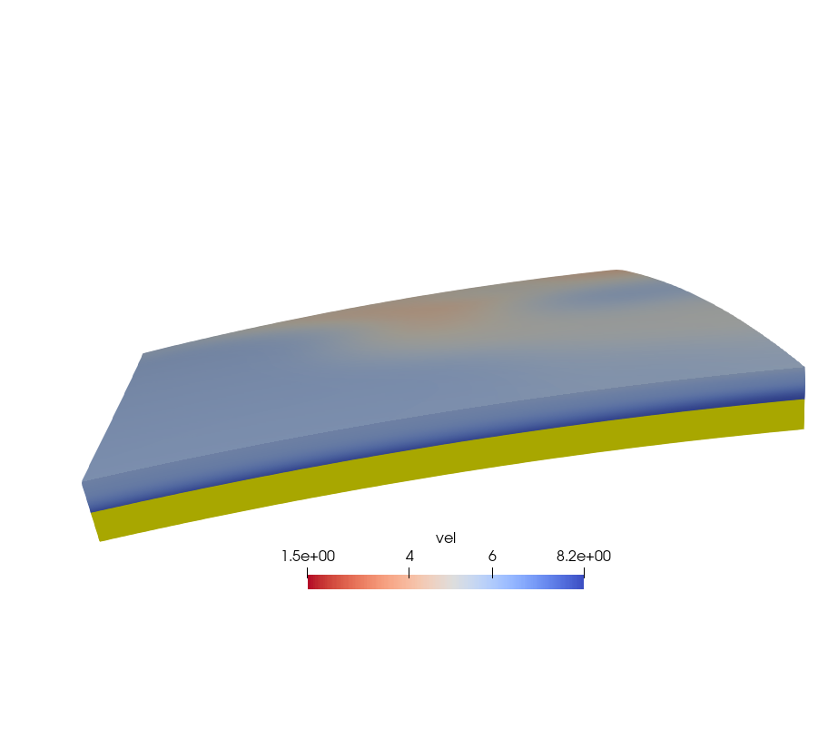
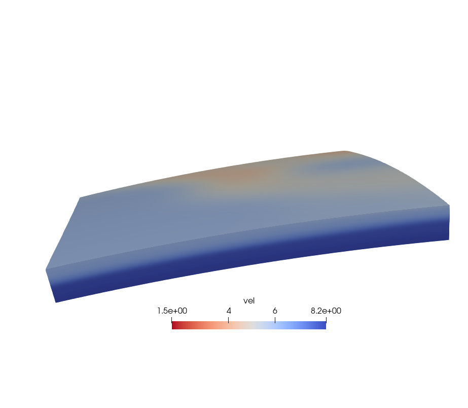

在三维地震成像中通常需要构建三维初始模型，这些模型往往来自已有的公共速度模型或其他前人研究，尽管提供的模型多为规则网格，由于我们所需网格大小是自定义的，所以需要对其进行网格化。而网格化所用的插值算法多为线性插值，它存在一个弊端：**如果我们的网格范围比原先的大，将会出现`NaN`结果，无法用于后续计算。**

本文介绍通过两次插值的方法解决这一问题。

<!--more-->

## 1. 将原始模型线性插值到自定义网格

第一次插值，即将原始模型数据假设为散点，在Python用`scipy.interpolate.griddata`进行网格化。

```Python
import numpy as np
from scipy.interpolate import griddata

new_dep, new_lat, new_lon = np.meshgrid(dep, lat, lon, indexing='ij')
grid_vp = griddata(
    points[:, 0:3],
    points[:, 3], 
    (new_dep, new_lat, new_lon), 
    method='linear'
)
```

这里`dep`, `lat`和`lon`为所需网格深度、纬度和经度方向的坐标，均为一维数组。`points`是原始模型数据，共4列，分别为深度、纬度、经度和数值。这时线性插值后的结果如图。黄色区域即为`NaN`值区域，这样的模型不能满足我们的计算需求。



## 2. 用临近点插值将`NaN`值点赋值

这里用到第二次插值，利用临近点插值 (Nearest Interpolation) 进行外插，填补空值点，同时保证数值不会偏离正常值。这里的思路是将非空值点取出当作散点，用相同的网格进行临近点插值。

```python
index = np.where(~np.isnan(data))
values = data[index]
points = np.array(index).T
zidx = np.arange(data.shape[0])
yidx = np.arange(data.shape[1])
xidx = np.arange(data.shape[2])
zz, xx, yy = np.meshgrid(zidx, yidx, xidx, indexing='ij')
interpolated = griddata(
    points, values, 
    (zz, xx, yy), 
    method='nearest'
)
result = interpolated.reshape(data.shape)
```

两次插值之后的结果如下图，`NaN`值部分已经由最底层速度填补。

